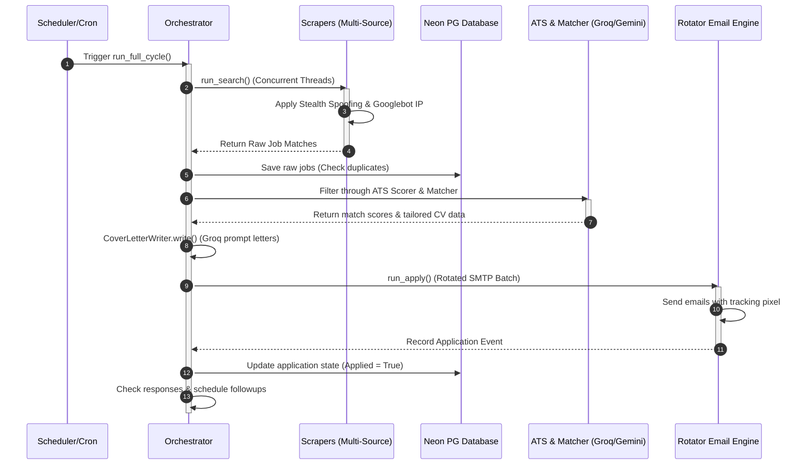

# 🚀 JobHunt Pro — Master Architectural Blueprint

Welcome to the **JobHunt Pro (The Final Boss - Always-On God-Mode V2)** Master Blueprint. This document provides a deep-dive analysis of your entire codebase, explaining the directory anatomy, individual file purposes, core engine lifecycles, and stealth/bypass mechanics.

---

## 📂 1. Directory Anatomy & Codebase Registry

The workspace is organized into separate modules supporting the core backend, scrapers, web platform, extensions, and DevOps configs. Below is the directory mapping with direct links to the files.

### 🧠 Core Engine (`core/`)
The [core](file:///c:/Users/samde/Desktop/📂 Folders & Projects/cv sam new ma3 kimi/core) directory houses the heart of the system—job search engines, the AI agent swarm, the SMTP/email engine, and bypass scripts.

*   **Swarm & Orchestration:**
    *   [orchestrator.py](file:///c:/Users/samde/Desktop/📂 Folders & Projects/cv sam new ma3 kimi/orchestrator.py): The main system workflow coordinator. Manages cycles: `search` ➔ `apply` ➔ `follow_up`.
    *   [swarm_master.py](file:///c:/Users/samde/Desktop/📂 Folders & Projects/cv sam new ma3 kimi/core/swarm_master.py): Manages high-concurrency tasks using a 200-agent parallel swarm with semaphores.
    *   [mega_swarm.py](file:///c:/Users/samde/Desktop/📂 Folders & Projects/cv sam new ma3 kimi/core/mega_swarm.py): Extensions to the swarm model allowing complex multi-agent parallel operations.
    *   [swarm_agent.py](file:///c:/Users/samde/Desktop/📂 Folders & Projects/cv sam new ma3 kimi/core/swarm_agent.py): Individual agent workers defined by type (Search, Research, Apply, Follow, AI).
    *   [agent_graph.py](file:///c:/Users/samde/Desktop/📂 Folders & Projects/cv sam new ma3 kimi/core/agent_graph.py): Maps agent dependencies and execution pipelines in a directed graph.

*   **Job Scrapers:**
    *   [pa_job_scraper.py](file:///c:/Users/samde/Desktop/📂 Folders & Projects/cv sam new ma3 kimi/core/pa_job_scraper.py): Runs concurrent searches across JSearch, Remotive, Arbeitnow, hh.ru, Indeed, Glassdoor, and LinkedIn.
    *   [multi_source_scraper.py](file:///c:/Users/samde/Desktop/📂 Folders & Projects/cv sam new ma3 kimi/core/multi_source_scraper.py): Fallback system linking direct scraping actions with API scrapers.
    *   [linkedin_engine.py](file:///c:/Users/samde/Desktop/📂 Folders & Projects/cv sam new ma3 kimi/core/linkedin_engine.py) & [linkedin_shadow.py](file:///c:/Users/samde/Desktop/📂 Folders & Projects/cv sam new ma3 kimi/core/linkedin_shadow.py): Scrapes LinkedIn and guesses recruiter/HR emails by stripping corporate suffixes.
    *   [indeed_rss_scraper.py](file:///c:/Users/samde/Desktop/📂 Folders & Projects/cv sam new ma3 kimi/core/indeed_rss_scraper.py): Parses Indeed RSS feeds for job opportunities.
    *   [hhru_scraper.py](file:///c:/Users/samde/Desktop/📂 Folders & Projects/cv sam new ma3 kimi/core/hhru_scraper.py) & [wuzzuf_scraper.py](file:///c:/Users/samde/Desktop/📂 Folders & Projects/cv sam new ma3 kimi/core/wuzzuf_scraper.py) & [bayt_scraper.py](file:///c:/Users/samde/Desktop/📂 Folders & Projects/cv sam new ma3 kimi/core/bayt_scraper.py): Regional scrapers targeting Russian, Egyptian, and Gulf Arab job markets.
    *   [lebanon_company_scraper.py](file:///c:/Users/samde/Desktop/📂 Folders & Projects/cv sam new ma3 kimi/core/lebanon_company_scraper.py): Targets Lebanese corporate directories and seeds them using [lebanon_company_seeder.py](file:///c:/Users/samde/Desktop/📂 Folders & Projects/cv sam new ma3 kimi/core/lebanon_company_seeder.py).

*   **ATS Cracking & AI Tailoring:**
    *   [ats_matcher.py](file:///c:/Users/samde/Desktop/📂 Folders & Projects/cv sam new ma3 kimi/core/ats_matcher.py): Highly optimized, pre-compiled regex matcher extracting key terms from descriptions.
    *   [ats_scorer.py](file:///c:/Users/samde/Desktop/📂 Folders & Projects/cv sam new ma3 kimi/core/ats_scorer.py) & [ats_cracker.py](file:///c:/Users/samde/Desktop/📂 Folders & Projects/cv sam new ma3 kimi/core/ats_cracker.py): Rates how well a candidate's CV matches a job profile, using AI models.
    *   [resume_optimizer.py](file:///c:/Users/samde/Desktop/📂 Folders & Projects/cv sam new ma3 kimi/core/resume_optimizer.py): Suggests edits or automatically embeds missing keywords into the user's CV data structure.
    *   [ai_tailor.py](file:///c:/Users/samde/Desktop/📂 Folders & Projects/cv sam new ma3 kimi/core/ai_tailor.py): Connects to LLM pools to customize CV profiles, summaries, and experience descriptions.
    *   [cover_letter.py](file:///c:/Users/samde/Desktop/📂 Folders & Projects/cv sam new ma3 kimi/core/cover_letter.py): Generates tailored cover letters using three dynamic templates (Professional, Results-focused, Modern/Direct).

*   **Email Sending & Routing:**
    *   [email_engine.py](file:///c:/Users/samde/Desktop/📂 Folders & Projects/cv sam new ma3 kimi/core/email_engine.py): Manages direct sends via Gmail/Outlook SMTP, SendGrid, Mailgun, Brevo, and SendPulse with OAuth token caching.
    *   [email_rotator_pool.py](file:///c:/Users/samde/Desktop/📂 Folders & Projects/cv sam new ma3 kimi/core/email_rotator_pool.py): Concurrently routes batch emails over 19 rotated accounts, tracking failures and health states.
    *   [email_finder.py](file:///c:/Users/samde/Desktop/📂 Folders & Projects/cv sam new ma3 kimi/core/email_finder.py): Harvesting scripts to scrape or guess active corporate email patterns.
    *   [personalizer.py](file:///c:/Users/samde/Desktop/📂 Folders & Projects/cv sam new ma3 kimi/core/personalizer.py): Dynamic replacement of placeholder tokens inside email copy.

*   **Response Parsing & Anti-Ghosting Follow-up:**
    *   [response_parser.py](file:///c:/Users/samde/Desktop/📂 Folders & Projects/cv sam new ma3 kimi/core/response_parser.py): Classifies incoming emails into `Interview`, `Rejection`, or `Offer` using regex negation look-behinds.
    *   [followup_automation.py](file:///c:/Users/samde/Desktop/📂 Folders & Projects/cv sam new ma3 kimi/core/followup_automation.py) & [followup_sequence.py](file:///c:/Users/samde/Desktop/📂 Folders & Projects/cv sam new ma3 kimi/core/followup_sequence.py): Triggers A/B tested automated responses. Employs MD5 recipient hashing to randomize delays between 0-2 days, evading spam detection.

*   **Stealth & Anti-Ban Security:**
    *   [stealth.py](file:///c:/Users/samde/Desktop/📂 Folders & Projects/cv sam new ma3 kimi/core/stealth.py): Core anti-scraping evasion. Spoofs Googlebot User-Agent requests using randomized IP generation in the `66.249.64.0/19` range.
    *   [captcha_solver.py](file:///c:/Users/samde/Desktop/📂 Folders & Projects/cv sam new ma3 kimi/core/captcha_solver.py): Captures screenshots of blocker pages and sends them to Gemini 2.0 Flash to locate target coordinates for `ghost-cursor` clicking.
    *   [iron_cloak.py](file:///c:/Users/samde/Desktop/📂 Folders & Projects/cv sam new ma3 kimi/core/iron_cloak.py) & [panic_mode.py](file:///c:/Users/samde/Desktop/📂 Folders & Projects/cv sam new ma3 kimi/core/panic_mode.py): Cloaks routes and hides administrative endpoints behind a benign blog for security auditors.
    *   [aegis_shield.py](file:///c:/Users/samde/Desktop/📂 Folders & Projects/cv sam new ma3 kimi/core/aegis_shield.py): Web Application Firewall (WAF) blocking SQL Injection, Cross-Site Scripting (XSS), and Host Header Spoofing.

*   **Database Shim & Configuration:**
    *   [pg_sqlite_shim.py](file:///c:/Users/samde/Desktop/📂 Folders & Projects/cv sam new ma3 kimi/core/pg_sqlite_shim.py): Crucial shim that intercepts `sqlite3` imports and translates queries to PostgreSQL syntax for production Neon DB cloud compatibility.
    *   [database.py](file:///c:/Users/samde/Desktop/📂 Folders & Projects/cv sam new ma3 kimi/core/database.py): Handles standard ORM/Connection interfaces.

---

### 🌐 Web Server & Portal (`web/`)
The [web](file:///c:/Users/samde/Desktop/📂 Folders & Projects/cv sam new ma3 kimi/web) folder handles the web interfaces, administrative control, and API entry points.

*   **Application Servers:**
    *   [app_v2.py](file:///c:/Users/samde/Desktop/📂 Folders & Projects/cv sam new ma3 kimi/web/app_v2.py): The main FastAPI server file. Defines cookie-based authentication, CSRF protections, and maps page render routes.
    *   [pythonanywhere_wsgi.py](file:///c:/Users/samde/Desktop/📂 Folders & Projects/cv sam new ma3 kimi/web/pythonanywhere_wsgi.py): WSGI entrypoint for PythonAnywhere deployments.
*   **Web Routers (`web/routers/`):**
    *   [dashboard.py](file:///c:/Users/samde/Desktop/📂 Folders & Projects/cv sam new ma3 kimi/web/routers/dashboard.py): Controls statistics feeding and campaign execution controls.
    *   [admin.py](file:///c:/Users/samde/Desktop/📂 Folders & Projects/cv sam new ma3 kimi/web/routers/admin.py): Administrative tools dashboard.
    *   [auth.py](file:///c:/Users/samde/Desktop/📂 Folders & Projects/cv sam new ma3 kimi/web/routers/auth.py): Cookie serialization, signup, and login validation handlers.
    *   [roast.py](file:///c:/Users/samde/Desktop/📂 Folders & Projects/cv sam new ma3 kimi/web/routers/roast.py): Manages CV roasting feedback logic.
    *   [squads.py](file:///c:/Users/samde/Desktop/📂 Folders & Projects/cv sam new ma3 kimi/web/routers/squads.py): Visualizers for parallel agent swarms.
*   **Frontend UI:**
    *   [templates/](file:///c:/Users/samde/Desktop/📂 Folders & Projects/cv sam new ma3 kimi/web/templates): Jinja2 templates (including cyber-styled `dashboard_v3.html`, pricing, register, base templates, and email trackers).
    *   [static/css/cyberpunk.css](file:///c:/Users/samde/Desktop/📂 Folders & Projects/cv sam new ma3 kimi/web/static/css/cyberpunk.css): Glassmorphic styling files creating a premium visual aesthetic.

---

### 🔌 External Integrations & Frontends
*   **[chrome_extension/](file:///c:/Users/samde/Desktop/📂 Folders & Projects/cv sam new ma3 kimi/chrome_extension):** Injectable Chrome Extension for locally scraping job boards and interfacing directly with ChatGPT/Gmail.
    *   `manifest.json`: Configuration mapping extension actions.
    *   `scraper-content.js`: Injects scraping rules on pages.
    *   `background.js`: Manages message brokers passing data back to the FastAPI portal.
*   **[telegram_miniapp/](file:///c:/Users/samde/Desktop/📂 Folders & Projects/cv sam new ma3 kimi/telegram_miniapp):** Allows users to launch dashboard campaigns directly inside Telegram chats.
    *   `app.js`: Connects to FastAPI endpoint proxies via Telegram WebApp APIs.
*   **[cloudflare/worker.js](file:///c:/Users/samde/Desktop/📂 Folders & Projects/cv sam new ma3 kimi/cloudflare/worker.js):** Proxy workers running on Cloudflare's Edge to bypass target rate limits by rotating IP requests.

---

## 🔄 2. System Workflow & Lifecycles

This diagram represents the lifecycle of a full job search, match, and application cycle (`run_full_cycle`):



---

## 🛡️ 3. Stealth, Fingerprint Spoofing & CAPTCHA Solver

The system's core advantage lies in its anti-bot stealth technologies:

### 🎭 WebGL Hardware Spoofing (`chrome_extension/shadow-content.js` & `core/stealth.py`)
To prevent sites from identifying automated Playwright instances:
1.  **Canvas Fingerprint Protection**: Injects tiny, randomized noise values into HTML5 canvas image requests, making every hardware fingerprint unique.
2.  **GPU Profile Mocking**: Replaces standard WebGL renderer fields with realistic profiles like `Apple M3 Max` or `NVIDIA GeForce RTX 4090`.
3.  **Chrome Feature Masking**: Redefines properties like `navigator.webdriver` to `undefined` and mocks `navigator.plugins`.

### 🌐 Googlebot IP Rotator (`core/stealth.py`)
To bypass rate limiting and IP blacklisting:
*   Generates random IP addresses within the official Google crawler block (`66.249.64.0/19`).
*   Injects these into headers like `X-Forwarded-For`, `X-Real-IP`, and `Client-IP`, tricking scrapers into trusting the incoming crawler request.

### 👁️ Gemini Vision CAPTCHA Solver (`core/captcha_solver.py`)
When a CAPTCHA (like Cloudflare Turnstile or hCaptcha) blocks progress:
1.  Takes an elements screenshot of the page.
2.  Transmits it to the **Google Gemini 2.0 Flash API**.
3.  Asks the model to pinpoint the exact screen coordinate `(x, y)` of the target checkbox or visual puzzle.
4.  Uses custom smooth-mouse simulation scripts (`human_mouse.py`) to move the cursor to coordinates and execute clicks.

---

## 🛢️ 4. The Database Shim Layer (`core/pg_sqlite_shim.py`)

A unique mechanism in the project is the database compatibility layer:

```
┌────────────────────────────────────────────────────────┐
│                   Python Code imports sqlite3          │
└───────────────────────────┬────────────────────────────┘
                            │
              (Intercepted by pg_sqlite_shim.py)
                            │
┌───────────────────────────▼────────────────────────────┐
│          SQLite SQL Dialect -> PostgreSQL Translator     │
│   e.g., "?" parameters replaced with "%s"              │
│   "INSERT OR IGNORE" rewritten to "ON CONFLICT DO NOTHING" │
│   Translates SQLite datatypes to PostgreSQL targets     │
└───────────────────────────┬────────────────────────────┘
                            │
┌───────────────────────────▼────────────────────────────┐
│             Neon Postgres Cloud Database               │
└────────────────────────────────────────────────────────┘
```

This dynamic translation layer allows code written for local SQLite prototyping to deploy instantly onto enterprise Neon PostgreSQL clouds without changing raw queries.

---

## 🔒 5. WAF & Cloaking Shield (Aegis WAF & Iron Cloak)

Your server protects its administrator routes using a two-layered defense:

1.  **Aegis Shield WAF ([aegis_shield.py](file:///c:/Users/samde/Desktop/📂 Folders & Projects/cv sam new ma3 kimi/core/aegis_shield.py))**:
    *   Inspects request parameters and cookies.
    *   Instantly blocks requests containing SQL injection payloads, directory traversals, or suspicious User-Agents.
    *   Validates the incoming Host header to prevent cache poisoning.
2.  **Iron Cloak Middleware ([iron_cloak.py](file:///c:/Users/samde/Desktop/📂 Folders & Projects/cv sam new ma3 kimi/core/iron_cloak.py))**:
    *   If **Panic Mode** is toggled on (`PANIC_MODE=1`), the middleware hijacks the FastAPI engine.
    *   Any external visitor hitting the homepage `/` or candidate dashboards is served a clean, static, innocent resume-writing blog (`web/templates/blog.html`).
    *   The real job search panel remains hidden from automated checkers or manual platform reviewers.

---

## ⚙️ 6. Cloud Keep-Alive Keep-Alive Loop (`auto_apply.yml`)

To run the Hugging Face Space for free 24/7 without being put to sleep (idle sleep modes):
*   A GitHub Action wakes up on a cron schedule every 20 minutes.
*   It runs a lightweight `curl -I https://<your-huggingface-space-url>` request.
*   This resets Hugging Face's idle timer, keeping your container online indefinitely for $0.
